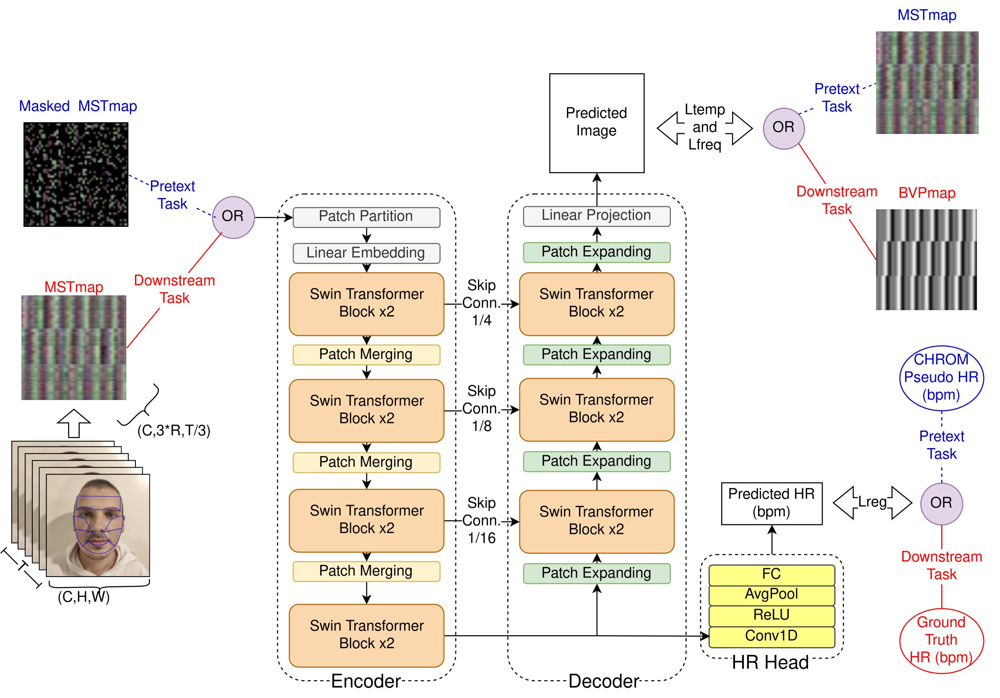

# PhySU-Net
 This is the official code repository of our ICPR 2024 paper entitled "PhySU-Net: Long Temporal Context Transformer for rPPG with Self-Supervised Pre-training". PhySU-Net, is a novel remote photoplethysmography (rPPG) method designed to address the limitations of current approaches. We propose the first long temporal context rPPG transformer network, along with a self-supervised pre-training strategy that leverages unlabeled data. PhySU-Net achieves state-of-the-art performance on public benchmark datasets (OBF, VIPL-HR, and MMSE-HR), demonstrating improved robustness and accuracy in contactless cardiac activity measurement from facial videos. Our self-supervised pre-training, utilizing traditional methods and image masking to generate pseudo-labels, further enhances the model's performance by effectively utilizing unlabeled data.

 You can find our paper at https://link.springer.com/chapter/10.1007/978-3-031-78341-8_15

Method Overview: The input video is processed into a stacked MSTmap. For the supervised downstream task, the decoder reconstructs an image with similar temporal and frequency properties as the BVPmap label, and the HR head regresses the global HR value with the HR ground truth as label. For the self-supervised pretext task, only the input and the labels change. The input is a masked version of the MSTmap that the decoder attempts to reconstruct into a full MSTmap. For the HR regression, a CHROM calculated pseudo-label is used.
 

